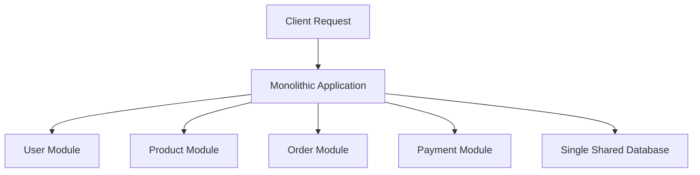
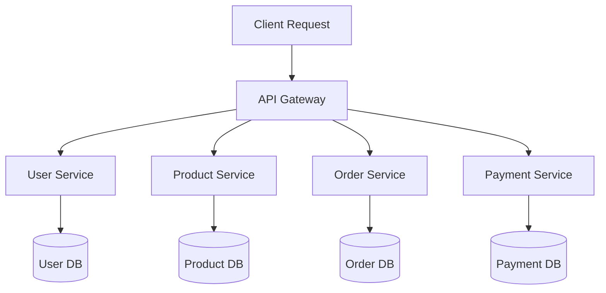
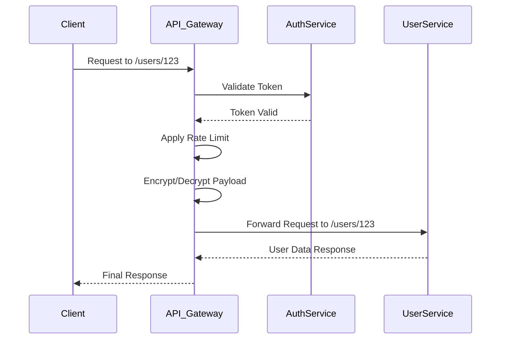
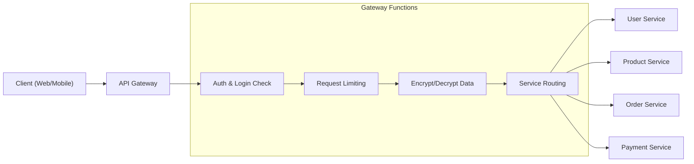
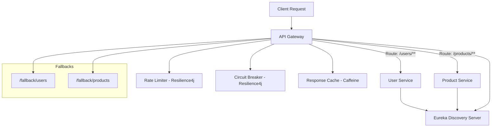
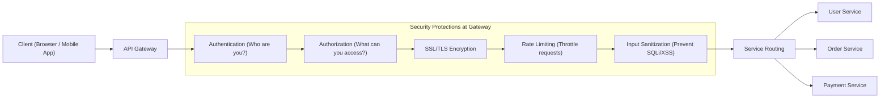
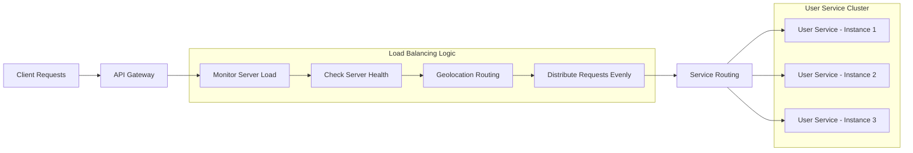
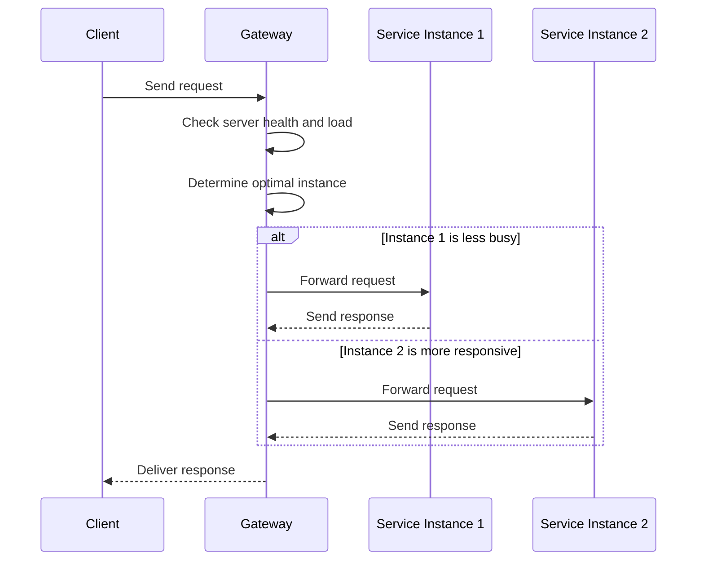

## General
### 1) What are microservices?
Microservices are a way to build software where each part of the application does a specific job and works independently. 
This setup makes it easier to manage, update, and scale the application because each part can be changed or fixed without affecting the whole system. 
Each piece communicates with others through simple, common methods, making it flexible and efficient to handle.

**Monolith:**


**Micro Services:**



### 2) How do microservices differ from monolithic architectures?
Microservices split an application into small, separate pieces that work on their own, making it easier to update and scale specific parts without disrupting the whole app. In contrast, a monolithic architecture builds the entire app as one big piece, which can make changes and updates more complicated as everything is interconnected.

```
FolderStructure: representing code at each artifact i.e. com.services.project as a @SpringBootApplication

Monolith: 
@SpringBootApplication
	Product : Controller, Service, Repository, Model, DTO
	Inventory : Controller, Service, Repository, Model, DTO
	Order : Controller, Service, Repository, Model, DTO

Microservices:
@SpringBootApplication 
	Product : Controller, Service, Repository, Model, DTO
@SpringBootApplication
	Inventory : Controller, Service, Repository, Model, DTO
@SpringBootApplication
	Order : Controller, Service, Repository, Model, DTO

DedicatedMicroServiceApps
@SpringBootApplication -> APIGateWay
@SpringBootApplication -> EurekaServer
@SpringBootApplication -> ConfigServer
```


### 3) What are some benefits of using microservices?
Microservices have several advantages: they allow each part of an application to grow or shrink as needed, which helps handle more users smoothly. 
Teams can use different tools and languages for different parts, making it easier to use the best technology for each task. 
Changes and updates can be made to one part without affecting others, which speeds up improvements and reduces problems. 
If one part fails, the rest of the application can still work, which makes the whole system more reliable.


### 4) Can you mention any challenges you might face while working with microservices?
While working with microservices, I face several challenges. One major issue is managing the communication between numerous small services, which can lead to problems like network latency and ensuring data consistency. 
Debugging and troubleshooting become more difficult because errors can occur in any of the many services. Setting up and maintaining monitoring and logging for each service is also complicated. 
Additionally, ensuring security across all services is crucial but challenging, as each service must be individually secured and regularly updated.


## API Gateway
### 5) What is the role of an API Gateway in microservices?
An API Gateway in microservices acts like a main entrance, directing incoming requests to the correct service within the application. It helps manage traffic, offers security checks like
login verification, and can improve performance by handling tasks that are common across services, such as encrypting data and limiting how many requests come in. 
This setup simplifies how clients interact with the app, making it easier to use and more secure.








### 6) How does an API Gateway manage traffic?

An API Gateway helps manage traffic by directing requests to the right part of the application and spreading the workload evenly to avoid overloading any single service. 
It can limit the number of requests to maintain smooth operation and prevent crashes during busy times. 
The API Gateway can also remember common responses, reducing the need to ask the backend services repeatedly, which speeds up the process and reduces the load on the system.

**Flow Diagram**



### 7) What are some security measures that can be implemented at the API Gateway?
At the API Gateway, we can boost security by adding several protections. This includes checking user identities (authentication), ensuring they have the right permissions (authorization), and encrypting data sent over the internet (SSL/TLS encryption). The gateway can also limit how many requests a user can make to prevent overload and attacks (rate limiting). Plus, it checks and cleans up the data coming in to stop harmful actions like SQL injection or XSS attacks. These steps help keep the application safe from attacks.




### 8) Can you explain how an API Gateway can handle load balancing?
An API Gateway manages load balancing by spreading out incoming traffic evenly across multiple services or servers. This prevents any one part of the application from getting too many requests and possibly slowing down or crashing. The gateway decides where to send each request based on how busy servers are, how they are performing, and where the user is located. This way, the application runs more smoothly and responds faster to users.

**Flow Diagram**



**Sequence Diagram**



## Communication
### 9) How do microservices communicate with each other?
Microservices communicate with each other using simple methods like HTTP (the same technology that powers the web) or through messaging systems that send and receive information. They use specific interfaces called APIs, which let them exchange data and requests without needing to know how other services are built. This setup allows them to work together as parts of a single application, each handling its tasks and talking to others as needed.

### 10) What is synchronous vs. asynchronous communication?
Synchronous communication is like having a conversation on the phone—we talk, then the other person immediately responds while both of we are connected. Asynchronous communication is like sending an email—we send a message and the other person can reply whenever they have time, without both needing to be present at the same moment. In software, synchronous means waiting for a task to finish before starting another, while asynchronous allows tasks to run in the background, letting we do multiple things at once.


### 11) Can you explain the role of message brokers in microservices?
In microservices, message brokers help different parts of an application talk to each other without being directly connected. They act like mail carriers, picking up messages from one service and delivering them to another. This helps keep the services independent and improves the system’s ability to handle more users or tasks smoothly. Message brokers manage the queuing, routing, and safe delivery of messages, making communication more reliable and efficient.

### 12) What are some of the risks involved with inter-service communication?
When different services in a microservices architecture talk to each other, there are a few risks. Network problems can slow down communication or cause messages to get lost, which can mess up how the application works. Managing many services talking to each other can also lead to mistakes or inconsistent data if they're not perfectly synchronized. Each service is also a potential weak spot for security—if one service has a security issue, it could affect the whole system. Lastly, relying heavily on network communication can make it tough to find and fix problems when they happen.