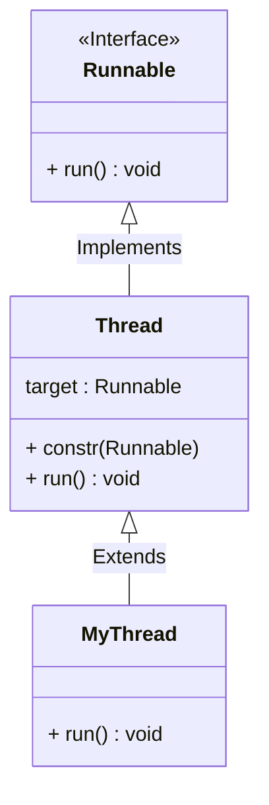
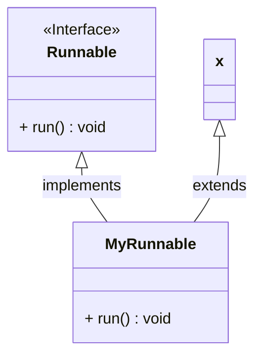

Below codes are taken from javaguides.net
###### 1) JavaGuides.MyThread.java
###### 2) JavaGuides.RunnableExample.JavaGuides.RunnableExample

Riddi Dutta java multi-threading Full course.

### Multitasking:

Multitasking allows several activities to occur concurrently on the computer.
	1. Process-based multitasking
	2. Thread-based multitasking

**Process Based Multitasking:**
Allows processes (i.e programs) to run concurrently on the computer.
Eg: Running the Ms Paint while also working with the word processor.

**Thread Based Multitasking:** *(i.e. Multitasking within a process)*
Allows parts of the same program to run concurrently on the computer.
Eg: Ms Word that is printing and formatting text at the same time.


### Threads vs Process :

Two threads share the same address space
Context switching between threads is usually less expensive than between processes.
The cost of communication between threads is relatively low.

### Why MultiThreading?
In a single-threaded environment, only one task at a time can be
performed.
CPU cycles are wasted, for example, when waiting for user input.
Multitasking allows idle CPU time to be put to good use.


### Threads:
A thread is an independent sequential path of execution within a
program.
Many threads can run concurrently within a program.
At runtime, threads in a program exist in a common memory space
and can, therefore, share both data and code (i.e., they are
lightweight compared to processes).


3 Important Concepts related to Multithreading in Java
Creating threads and providing the code that gets executed by a
thread.
Accessing common data and code through synchronization.
Transitioning between thread states.


### The Main Thread:
When a standalone application is run, a user thread is automatically
created to execute the `main()` method of the application. This thread
is called the `main thread`.
If **no other user threads** are spawned, the program terminates when
the `main()` method finishes executing.
All other threads, called **child threads**, are spawned from the main
thread.
The main() method can then finish, but the program will **keep running** until all user threads have completed.
The runtime environment distinguishes between **user threads** and **daemon threads**.

Calling the `setDaemon(boolean)` method in the Thread class marks
the status of the thread as either **daemon** or **user**, but this must be
done before the thread is started.
As long as a user thread is alive, the JVM does not terminate.
A daemon thread is at the mercy of the runtime system: it is stopped
if there are no more user threads running, thus terminating the
program.


```java
// code inside Thread class
class Thread implements Runnable {
	Runnable target;
	@Override
	void run(){
		if(target != null){
			target.run();
		}
	}	
}
```




```java
// Instead of MyThread extends Thread, it's good to approach
class MyRunnable implements Runnable{
	@Override
	void run(){
		// block to be executed.
	}
}

Thread thread = new Thread(new MyRunnable())
```



```java
// above MyRunnable is Recommended, 
// where you can extend your class as Normal classes in OOPs and also it'll implement the Runnable.

// First approach isn't recommended, because the derived classes will be always and instanceof Thread itself.
```
